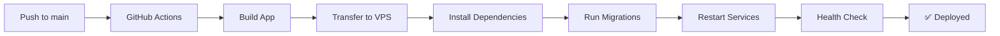

# 🚀 Software Hub - Automated Deployment

Complete automated deployment solution for Software Hub to Contabo VPS (95.111.253.111).

## 📋 Quick Start

### 1. VPS Setup (One-time)

SSH into your VPS and run the automated setup script:

```bash
ssh root@95.111.253.111

# Download and run setup script
curl -o vps-setup.sh https://raw.githubusercontent.com/yourusername/software-hub/main/scripts/vps-setup.sh
chmod +x vps-setup.sh
./vps-setup.sh
```

This will install:
- ✅ Node.js 20.x
- ✅ PM2 (Process Manager)
- ✅ Nginx (Web Server)
- ✅ PostgreSQL (Database)
- ✅ Firewall configuration
- ✅ Project directories

### 2. Configure GitHub Secrets

Add these secrets to your GitHub repository (Settings → Secrets → Actions):

| Secret Name | Value | How to Get |
|------------|-------|------------|
| `SSH_PRIVATE_KEY` | Your SSH private key | `ssh-keygen -t ed25519 -f ~/.ssh/software-hub-deploy` |
| `REMOTE_HOST` | `95.111.253.111` | Your VPS IP |
| `REMOTE_USER` | `root` | Your SSH user |
| `ENV_FILE` | Production env vars | See `.env.production.example` |

📖 **Detailed guide:** [docs/GITHUB_SECRETS.md](docs/GITHUB_SECRETS.md)

### 3. Deploy

Simply push to main branch:

```bash
git add .
git commit -m "Deploy to production"
git push origin main
```

GitHub Actions will automatically:
1. ✅ Build the application
2. ✅ Transfer files to VPS
3. ✅ Install dependencies
4. ✅ Run migrations
5. ✅ Restart services
6. ✅ Perform health check

## 📁 Project Structure

```
software-hub/
├── .github/
│   └── workflows/
│       └── deploy.yml          # GitHub Actions workflow
├── docs/
│   ├── DEPLOYMENT.md           # Complete deployment guide
│   └── GITHUB_SECRETS.md       # Secrets setup guide
├── scripts/
│   └── vps-setup.sh           # VPS initial setup script
├── deploy.sh                   # VPS deployment script
├── ecosystem.config.js         # PM2 configuration
├── nginx.conf                  # Nginx configuration
└── .env.production.example     # Environment variables template
```

## 🔧 VPS Configuration

### Environment Variables

Edit on VPS:
```bash
nano /var/www/software-hub/.env.production
```

Required variables:
- `DATABASE_URL` - PostgreSQL connection string
- `SESSION_SECRET` - Random secret for sessions
- `RESEND_API_KEY` - Email service API key
- `STRIPE_SECRET_KEY` - Payment gateway key

### Service Management

```bash
# View running processes
pm2 list

# View logs
pm2 logs

# Restart services
pm2 restart all

# View deployment log
tail -f /var/log/software-hub-deploy.log

# Check Nginx
systemctl status nginx
nginx -t

# Check database
sudo -u postgres psql software_hub
```

## 🌐 Nginx Configuration

The Nginx configuration includes:
- ✅ Reverse proxy to Node.js (port 5000)
- ✅ Static file serving with caching
- ✅ WebSocket support for Socket.io
- ✅ Gzip compression
- ✅ Security headers

Configuration file: `/etc/nginx/sites-available/software-hub`

## 🔒 Security Features

- ✅ SSH key authentication (no passwords)
- ✅ Firewall (UFW) configured
- ✅ Secrets stored in GitHub (encrypted)
- ✅ Environment variables not in repository
- ✅ Automated backups before deployment
- ✅ Security headers in Nginx

### Setup SSL/HTTPS (Recommended)

```bash
# Install Certbot
apt-get install certbot python3-certbot-nginx

# Get SSL certificate
certbot --nginx -d yourdomain.com

# Auto-renewal is configured automatically
```

## 📊 Monitoring

### Health Check

```bash
curl http://95.111.253.111/api/health
```

### PM2 Monitoring

```bash
# Real-time monitoring
pm2 monit

# Web dashboard (optional)
pm2 plus
```

### Logs

```bash
# Application logs
pm2 logs software-hub-server

# Nginx access logs
tail -f /var/log/nginx/software-hub-access.log

# Nginx error logs
tail -f /var/log/nginx/software-hub-error.log

# Deployment logs
tail -f /var/log/software-hub-deploy.log
```

## 🔄 Deployment Workflow



## 🆘 Troubleshooting

### Deployment Fails

1. **Check GitHub Actions logs:**
   - Go to Actions tab
   - Click on failed workflow
   - Review error messages

2. **SSH Connection Issues:**
   ```bash
   # Test SSH connection
   ssh -i ~/.ssh/software-hub-deploy root@95.111.253.111
   
   # Verify key is added to VPS
   cat ~/.ssh/authorized_keys
   ```

3. **Service Won't Start:**
   ```bash
   # Check PM2 logs
   pm2 logs --err
   
   # Check environment variables
   cat /var/www/software-hub/.env.production
   
   # Manually start
   cd /var/www/software-hub
   pm2 start ecosystem.config.js
   ```

### Database Issues

```bash
# Check PostgreSQL status
systemctl status postgresql

# Connect to database
sudo -u postgres psql software_hub

# Check connections
SELECT * FROM pg_stat_activity;
```

### Nginx Issues

```bash
# Test configuration
nginx -t

# Check status
systemctl status nginx

# Reload configuration
systemctl reload nginx

# View error log
tail -f /var/log/nginx/software-hub-error.log
```

## 📚 Documentation

- **[Complete Deployment Guide](docs/DEPLOYMENT.md)** - Detailed setup instructions
- **[GitHub Secrets Setup](docs/GITHUB_SECRETS.md)** - Configure deployment secrets
- **[Environment Variables](.env.production.example)** - Configuration template

## 🔗 Useful Links

- **VPS IP:** http://95.111.253.111
- **GitHub Actions:** https://github.com/yourusername/software-hub/actions
- **PM2 Documentation:** https://pm2.keymetrics.io/
- **Nginx Documentation:** https://nginx.org/en/docs/

## 📞 Support

For deployment issues:
- Email: admin@in2sight.com
- Check logs on VPS
- Review GitHub Actions output

## 🎯 Next Steps

After successful deployment:

1. ✅ Setup SSL certificate with Let's Encrypt
2. ✅ Configure domain name (if applicable)
3. ✅ Setup monitoring and alerts
4. ✅ Configure automated backups
5. ✅ Setup CDN for static assets (optional)
6. ✅ Enable PM2 monitoring dashboard

---

**Last Updated:** 2026-01-25  
**VPS:** 95.111.253.111  
**Stack:** Node.js 20 + PostgreSQL + Nginx + PM2
